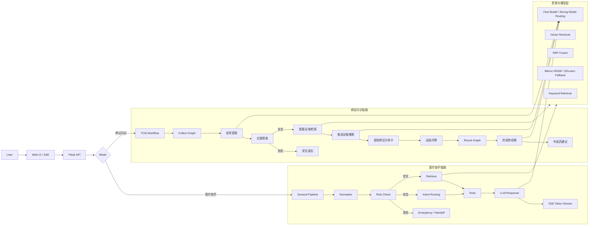
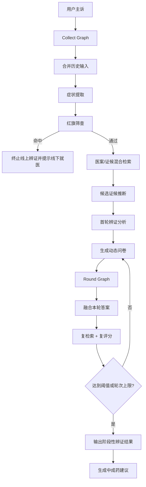

# 智能医疗对话与诊疗 Agent 助手


> 一个面向医疗咨询场景的 Agent 助手demo，覆盖医疗咨询与辨证问诊两条工作流。  
> 项目主要以医疗方向的聊天助手出发，技术细节包括语义路由、安全分流、混合 RAG、多轮状态编排、模型调度与延迟优化等。


## 项目简介

本项目使用 `LangChain + LangGraph + Flask` 构建了一套智能医疗对话与诊疗 Agent 产品。产品面向真实医疗咨询流程，围绕“专问专答、风险优先、过程可控、异常可回退”设计，支持医疗咨询和辨证问诊双模式，并对检索链路、模型路由、缓存与前端交互做了较完整的工程化优化。


- 语义路由分流：规则分类 + LLM 精修，动态分流到症状咨询、产品咨询、报告解读、用药咨询、医学科普、人工服务等模块。
- 双工作流编排：医疗咨询链路与辨证问诊链路显式拆分，避免单 Prompt 承担全部业务逻辑。
- 分层记忆管理：普通咨询实现 `M0-M3 + M2` 组合记忆，覆盖最近窗口、段内摘要、长期事实与医疗核心实体，缓解长对话串味。
- 多轮中医辨证 Agent：基于 LangGraph 构建 `Collect Graph + Round Graph`，通过动态问卷逐轮筛选证候并收敛。
- 混合 RAG 检索：支持 `txt / md / docx / jsonl` 异构语料，使用关键词召回、向量召回、RRF 融合、来源权重与分源召回配额共同优化结果。
- 安全优先架构：高危症状与敏感内容优先拦截，中断生成并给出急诊/人工接管建议。
- 稳定性与延迟优化：全链路异步并发、三级缓存、模型降级与规则兜底共同保证响应速度和稳定性。
- 前端过程可视化：普通咨询支持 SSE 流式输出，中医模式支持阶段卡片、辨证结果卡、动态问卷卡，降低“长时间无反馈”的等待感。

项目内置的专项多方位的系统测试，重点包括：

- 复杂意图识别：覆盖模糊潜在意图、复合意图、多意图排序与单主意图路由。
- 提示词注入与风控：覆盖高危症状、安全拦截、应急分流与规则兜底。
- 多级记忆：覆盖 `M0` 窗口、`M1` 摘要、`M2` 长期事实、`M3` 医疗核心实体写入与召回。
- API 与流式响应：覆盖 `/api/chat`、`/api/chat/stream`、`/api/chat/feedback`。
- 并发与稳定性：通过 `Locust` 压测普通功能、安全风控与 SSE 流式接口。

## 核心能力与优化

| 模块 | 实现方式 | 工程价值 |
| --- | --- | --- |
| 语义路由分流 | 规则意图分类 + LLM 结构化精修 + 低置信度转人工 | 让不同问题进入不同链路，实现专问专答 |
| 医疗咨询工作流 | `normalize -> risk -> intent/retrieve并发 -> tools -> response` | 将安全、检索、工具、回复拆成可控阶段 |
| 辨证问诊工作流 | `Collect Graph + Round Graph` 双图状态机 | 支持多轮问诊、动态问卷与阶段性辨证 |
| 记忆管理 | `M0 最近窗口 + M1 段内摘要 + M2 长期记忆 + M3 医疗核心实体` | 降低长对话遗忘、重复追问与跨意图串扰 |
| 混合 RAG | 关键词检索 + 向量检索 + RRF + 分数补偿 + 来源权重 + 分源配额 | 提升异构语料召回质量，降低单一来源偏置 |
| 语料处理 | `txt` 按行清洗截断，`md/docx` 按段抽取后再做句级聚合切分 | 兼顾书籍类语料覆盖率与检索粒度 |
| Milvus 向量层 | Milvus 集合拆分、默认 HNSW、支持本地向量后端兜底 | 为更大规模语料预留扩展空间 |
| 模型后端抽象 | 聊天层与 embedding 层均支持多平台切换 | 降低模型迁移成本，方便后续接入更多供应商 |
| 模型路由 | 意图识别/猜你想问/症状提取走快模型，主回答/辨证分析走强模型 | 在速度与效果之间做任务级平衡 |
| 安全架构 | 红旗症状、敏感词/正则内容拦截、人工接管摘要 | 适配医疗场景对风险控制的要求 |
| 延迟优化 | 异步流水线、阶段级缓存、猜你想问并行预取、记忆清洗降级 | 降低首包等待和重复请求开销 |
| 交互体验 | SSE 流式输出、阶段进度卡、辨证结果卡、问卷卡 | 把复杂 Agent 过程可视化，提升可感知性 |

## 系统流程图

### 1. 总体架构



### 2. 辨证问诊状态流



## 技术方案

### 1. 医疗咨询链路

医疗咨询入口位于 [`app/async_pipeline.py`](./app/async_pipeline.py)、[`app/workflow.py`](./app/workflow.py)、[`app/llm_chains.py`](./app/llm_chains.py)。

核心设计不是“直接把用户输入交给 LLM”，而是按阶段拆解：

1. 文本标准化与高危风险筛查。
2. `intent` 与 `retrieve` 在安全检查后并发执行。
3. 根据意图调用规则工具与检索结果组装上下文。
4. 强模型生成主回复，快模型并行预取“猜你想问”。
5. 通过 SSE 把阶段状态和流式文本同时推给前端。

这条链路的重点是：既保证医疗场景下的边界控制，又把能并行的阶段前置并行，减少用户等待。

医疗咨询链路还实现了分层记忆：

- `M0`：只保留当前意图段最近 3 轮原文，用于保证短窗口上下文的表达细节。
- `M1`：把当前意图段更早的轮次压缩为摘要行，避免长对话把提示词撑爆。
- `M2`：把高价值用户事实清洗后写入本地长期记忆文件，并按 query 检索召回。
- `M3`：维护医疗核心实体记忆，重点记录过敏史、慢病/基础病、当前用药、妊娠/哺乳、手术住院史、家族史。

为减少长对话“串味”，医疗咨询做了两层控制：

- 先按意图与语义漂移把会话切成 segment，当前轮默认只读取活跃 segment 的 `M0 + M1`。
- `M2` 检索阶段会优先召回同意图长期记忆，跨意图内容默认降权，只有相似度足够高才会回补。

### 2. 辨证问诊链路

辨证链路位于 [`app/tcm_graph.py`](./app/tcm_graph.py) 与 [`app/tcm.py`](./app/tcm.py)。

它被拆成两张显式状态图：

- `Collect Graph`：收集症状、红旗筛查、医案检索、候选证候推断、首轮问卷生成。
- `Round Graph`：合并问卷答案、再次检索与复评分、决定继续追问还是收敛输出。

这套设计解决了两个核心问题：

- 辨证问诊不是单轮问答，而是需要逐步收集信息并逐轮筛选证候。
- 同一轮里不仅要产出结果，还要产出“下一轮该问什么”的区分性问题。

### 3. 混合 RAG 设计

检索层的重点不只是“接一个向量库”，而是对异构语料做了针对性处理：

- `txt` 医案：按行清洗，并截断到“处方”之前，减少药物列表对症状语义的污染。
- `md` 证候：按段抽取，再按句聚合成较大 chunk。
- `docx` 医案：直接解析 `word/document.xml` 提取段落，再按句聚合切分。
- `md/docx` 书籍类语料：采用“中轴优先、向两侧扩散”的采样顺序，提高中部知识覆盖率。
- 中成药语料：使用 `jsonl` 成品分段文件，一行一个条目，直接入库。

检索融合策略包括：

- 关键词召回
- 向量召回
- RRF 融合
- 分数补偿
- 来源权重
- 分源召回上限与保底配额

这一层是项目里非常有辨识度的工程点，因为它明确处理了多源语料偏置，而不是简单“向量相似度前 K”。

### 4. 模型路由与降级策略

模型编排位于 [`app/llm_chains.py`](./app/llm_chains.py) 与 [`app/tcm.py`](./app/tcm.py)。

当前策略是按任务复杂度分配模型：

- 医疗咨询意图识别：`doubao-seed-2-0-mini-260215`
- 医疗咨询主回复：`deepseek-v3-2-251201`
- “猜你想问”：`doubao-seed-2-0-mini-260215`
- 中医症状提取：`doubao-seed-2-0-mini-260215`
- 中医辨证分析 / 问卷 / 总结：`deepseek-v3-2-251201`

这样做的好处是：

- 结构化任务优先用更快模型，控制延迟。
- 推理和总结任务使用更强模型，保证生成质量。
- 当模型不可用时，普通咨询仍可回退到规则与检索结果兜底。
- 聊天模型与 embedding 模型都做了后端抽象，后续切换平台时无需重写业务链路。

### 5. 性能与稳定性优化

这部分是项目从“能跑”走向“可展示”的关键：

- 医疗咨询链路采用异步流水线，`intent` 与 `retrieve` 并行执行。
- “猜你想问”与主回复流式生成并行，避免在末尾额外等待。
- 设计了三级缓存：`L1 内存缓存 + L2 SQLite 热缓存 + L3 SQLite 冷缓存`。
- 缓存粒度不是只缓存最终回答，而是覆盖 `intent / retrieve / tools / final` 等阶段。
- 对模型调用增加 `LLM_TRACE` 日志，记录 prompt、response、model route，便于排查多模型编排问题。
- 长期记忆默认采用本地哈希向量检索，无需额外依赖即可落地；启用 LLM 清洗时带有失败熔断与冷却期，避免因模型异常拖慢主链路。

### 6. 前端交互设计

前端位于 [`web/templates/index.html`](./web/templates/index.html)、[`web/static/app.js`](./web/static/app.js)、[`web/static/style.css`](./web/static/style.css)。


- 医疗咨询支持 SSE 流式输出，并做前端细粒度切片，提升 token streaming 观感。
- 辨证模式支持阶段状态卡，按“提取症状 / 风险筛查 / 检索医案 / 辨证分析 / 生成问卷”逐步推进。
- 辨证结果与问卷拆成独立卡片，减少大段等待期间的空白感。
- 多轮问卷以新卡片追加，而不是覆盖旧轮结果，方便观察辨证收敛过程。

## 项目结构

```text
.
├─ app/
│  ├─ async_pipeline.py      # 医疗咨询异步流水线 + 三级缓存
│  ├─ workflow.py            # 医疗咨询工作流与工具调度
│  ├─ llm_chains.py          # 意图识别 / 主回复 / 流式输出 / 模型路由 / 记忆清洗
│  ├─ prompts/               # 提示词集中管理（普通咨询主链路）
│  ├─ tcm_graph.py           # 辩证 Collect Graph + Round Graph
│  ├─ tcm.py                 # 中医检索、切分、问卷、辨证与总结
│  ├─ web.py                 # Flask API + SSE 接口 + 普通咨询 M0-M3/M2 记忆
│  ├─ guardrails.py          # 高危症状与敏感内容拦截
│  └─ tools.py               # 规则工具与本地知识库查询
├─ web/
│  ├─ templates/index.html
│  └─ static/app.js
├─ data/
│  ├─ medical_cases.txt
│  ├─ 证候/
│  ├─ 医案/
│  └─ 中成药/patent_sections_candidates.jsonl
├─ scripts/
│  ├─ rebuild_milvus.py      # 重建 Milvus 集合
│  ├─ export_patent_sections.py
│  └─ eval.py                # 轻量评测脚本
├─ tests/
│  ├─ datasets/              # 专项测试集（意图/注入/记忆）
│  ├─ locust/locustfile.py   # 并发与风控自动化压测脚本
│  └─ test_*.py              # pytest 功能测试
└─ requirements-dev.txt

```

## 快速开始

### 1. 安装依赖

```bash
python -m venv .venv
.venv\Scripts\activate
pip install -r requirements.txt
```

### 2. 推荐环境变量

当前推荐使用“火山方舟聊天模型 + SiliconFlow 词嵌入 + Milvus 向量库”：

```env
VOLCENGINE_API_KEY=your_volcengine_key
VOLCENGINE_BASE_URL=https://ark.cn-beijing.volces.com/api/v3
VOLCENGINE_INTENT_MODEL=doubao-seed-2-0-mini-260215
VOLCENGINE_CHAT_MODEL=deepseek-v3-2-251201

TCM_VOLCENGINE_EXTRACT_MODEL=doubao-seed-2-0-mini-260215
TCM_VOLCENGINE_MAIN_MODEL=deepseek-v3-2-251201
TCM_VOLCENGINE_THINKING=0

TCM_EMBEDDING_PROVIDER=siliconflow
SILICONFLOW_API_KEY=your_siliconflow_key
SILICONFLOW_BASE_URL=https://api.siliconflow.cn/v1
SILICONFLOW_EMBEDDING_MODEL=BAAI/bge-m3

TCM_VECTOR_BACKEND=milvus
MILVUS_URI=http://127.0.0.1:19530
TCM_MILVUS_USE_HNSW=1
CHAT_MEMORY_M0_TURNS=3
CHAT_MEMORY_M1_MAX_CHARS=1600
CHAT_MEMORY_MAX_SEGMENTS=12
CHAT_MEMORY_SEGMENT_SWITCH_STREAK=2
CHAT_MEMORY_SEGMENT_SIM_THRESHOLD=0.55
CHAT_MEMORY_INTENT_CONF_THRESHOLD=0.75

CHAT_MEMORY_M2_ENABLED=true
CHAT_MEMORY_M2_RETRIEVE_TOPK=3
CHAT_MEMORY_M2_MIN_SIM=0.12
CHAT_MEMORY_M2_INTENT_SAME_BONUS=0.14
CHAT_MEMORY_M2_INTENT_CROSS_PENALTY=0.08
CHAT_MEMORY_M2_CROSS_INTENT_MIN_SIM=0.18

CHAT_MEMORY_M2_LLM_CLEAN_ENABLED=false
CHAT_MEMORY_M2_LLM_MIN_SALIENCE=0.45
CHAT_MEMORY_M2_LLM_FAIL_STREAK_LIMIT=3
CHAT_MEMORY_M2_LLM_COOLDOWN_SEC=300
```

如果需要回退到本地向量检索，可设置：

```env
TCM_VECTOR_BACKEND=sklearn
```

### 3. 启动 Milvus 并重建集合

Milvus 推荐按官方 Docker Compose 方式单独启动。启动完成后执行：

```bash
python scripts/rebuild_milvus.py
```

这个脚本会：

- 清理旧 meta 信息
- 重建医案集合
- 重建中成药集合
- 按当前配置创建 Milvus 索引

### 4. 启动服务

Web 服务：

```bash
python -m app.web
```

CLI 调试：

```bash
python -m app.main --query "最近总是头晕，应该挂什么科？"
```

默认访问地址：

- `http://127.0.0.1:8000`

## 测试、评测与排障

如果你只看一个章节，建议优先看这里。

### 1. 一键测试汇总

一键汇总 `pytest + 专项数据集指标`：

```bash
python scripts/test_report.py
```

带短时 `Locust` 压测：

```bash
python scripts/test_report.py --with-locust
```

如需落盘完整 JSON 报告：

```bash
python scripts/test_report.py --with-locust --json-out data/test_report_latest.json
```

### 2. Pytest 回归测试

轻量评测脚本：

```bash
python scripts/eval.py
```

当前脚本输出：

- `high_risk_recall`
- `intent_accuracy`
- `handoff_rate`
- `avg_latency_ms`

执行全量回归：

```bash
pip install -r requirements-dev.txt
pytest
```

当前专项覆盖：

- `tests/test_intent_complex_dataset.py`：复杂意图识别数据集校验
- `tests/test_intent_multi_stage.py`：多意图识别与回复链路校验
- `tests/test_prompt_injection_guardrails.py`：提示词注入与高危分流校验
- `tests/test_memory_multilevel.py`：`M0-M3/M2` 多级记忆回归
- `tests/test_api_functional.py`：接口与流式响应回归

已内置测试数据集：

- `tests/datasets/intent_complex_cases.jsonl`：复杂意图、模糊潜在意图、多意图样本
- `tests/datasets/prompt_injection_cases.jsonl`：提示词注入与风险拦截样本
- `tests/datasets/memory_multilevel_cases.jsonl`：`M0-M3/M2` 多级记忆样本

### 3. Locust 并发压测

Locust 自动化并发测试覆盖产品功能 / 安全风控 / 流式响应：

```bash
# 先启动服务
python -m app.web

# 再开一个终端运行 Locust
locust -f tests/locust/locustfile.py --host http://127.0.0.1:8000
```

Locust 脚本默认包含三类流量任务：

- `/api/chat:functional`：正常功能请求与会话连续性
- `/api/chat:security`：高风险/注入输入的拦截校验
- `/api/chat/stream`：SSE 流式响应完整性（`meta/done` 事件）

### 4. 排障建议

如果需要排查模型编排与调用问题，可以观察终端中的 `LLM_TRACE` 日志，里面会打印：

- Prompt Payload
- Response Text
- Model Route
- Error Trace


## 说明

- 本项目是医疗咨询辅助系统，不提供临床诊断与个体化处方。
- 普通咨询 `M2` 长期记忆会持久化到 `data/general_long_memory.jsonl`，服务重启后可按 `session_id` 回灌。
- `M2` 默认使用本地哈希向量检索；如开启 `CHAT_MEMORY_M2_LLM_CLEAN_ENABLED=true`，会先尝试 LLM 清洗，失败时自动回退规则清洗并进入冷却期。
- Milvus 不可用时，中医向量检索可回退到本地 `SKLearnVectorStore`。

## 深入阅读

- [医疗咨询异步流水线](./app/async_pipeline.py)
- [医疗咨询工作流](./app/workflow.py)
- [中医辨证工作流](./app/tcm_graph.py)
- [中医核心能力实现](./app/tcm.py)

